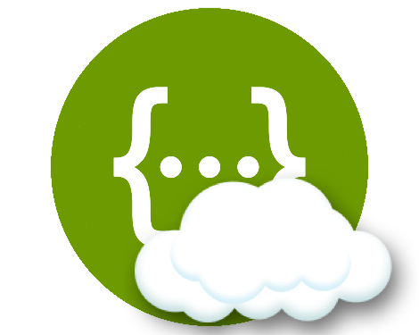

 Swagger Cloud 
=============================================================
[](https://travis-ci.org/moronicgeek/SwaggerCloud.svg?branch=master)
[](https://www.apache.org/licenses/LICENSE-2.0.txt)
[](https://www.codacy.com/app/patel-muhammed/SwaggerCloud?utm_source=github.com&amp;utm_medium=referral&amp;utm_content=moronicgeek/SwaggerCloud&amp;utm_campaign=Badge_Grade)
[](https://codecov.io/gh/moronicgeek/SwaggerCloud)

An API document catalog. This project centralises your swagger documentation in one portal. If your api has a swagger json file then the swagger cloud server can consume that to consolidate all your api documentation. 
The project leverages of the [swagger/swagger-ui](https://github.com/swagger-api/swagger-uiswagger/swagger-ui) project for the swagger interface. 
The server is a spring boot plugin that allows you to get up and running quickly. 

## What it is ?
It is a document cloud catalog. It catalogs your swagger applications documentation.  

## What it's not?
It's not an API Manager
 
 
## Usage
 
### Client(Standalone)

Simply add the following maven dependency to your project.
```
 <dependency>
            <groupId>za.co.moronicgeek.spring.swagger</groupId>
            <artifactId>client</artifactId>
            <version>${project.version}</version>
  </dependency>
```
 
 
and add the following resouces to your application.properties or application.yml
```

swagger.cloud.boot.client.name=IchiServerAPI
swagger.cloud.boot.client.swagger-url=http://localhost:8081/swagger.json

##Optional
swagger.cloud.boot.admin.url=http://localhost:8084
swagger.cloud.boot.admin.apiPath=/test/register

```
 
### Server(Standalone)
 The server requires a basic spring boot application with the (@EnableSwaggerCloudServer) annotation in your application config.
 The server could integrate with any other language as the server exposes a restful api for you to use. Please refer to the Server Api documentation in the wiki. [Server API](https://github.com/moronicgeek/SwaggerCloud/wiki/Server-Api)
 
 ```
   <dependency>
             <groupId>za.co.moronicgeek.spring.swagger</groupId>
             <artifactId>server</artifactId>
             <version>1.0-SNAPSHOT</version>
   </dependency>
 ```
 
 add this annotation to your SpringBootApplication configuration
 
 ```
 @EnableSwaggerCloud
 ```
 
 
### Modes

## Eureka
Swagger Cloud supports eureka service discovery which allows the Server to discover clients as they are registered.
The system reads the registry and pings clients for a success response at the /swaggercloud/properties endpoint.

Once discovered a delta is updated to swagger clouds registry. The server uses eureka to discover a client in an UP/DOWN
state.

### Get coding


 
 
 
### Need to generate a swagger.json file?
Have a look at the following projects to auto generate a swagger definition for you 

https://github.com/kongchen/swagger-maven-plugin

https://github.com/springfox/springfox

